# Northwind
Database Analysis &amp; SQL Exploration using MS SQL

> The Northwind database contains the sales data for a fictitious company called **Northwind Traders**, which imports and exports specialty foods from around the world.
> 
> 📌 **My task in this case study is to perform an analysis of the performance of this company using SQL.**

## 📂 Dataset

The Northwind dataset is composed of 13 tables:

<details>
<summary>
Show summary
</summary>

| Table               | Rows |
|---------------------|------|
| Categories          | 8    |
| Customers           | 91   |
| Employees           | 9    |
| EmployeeTerritories | 49   |
| Order Details       | 2155 |
| Orders              | 830  |
| Region              | 4    |
| Products            | 77   |
| Shippers            | 6    |
| Suppliers           | 29   |
| Territories         | 53   |
| Usstates            | 51   |

</details>

Here is the entity relationship diagram (ERD) for this dataset
<p align="center">
  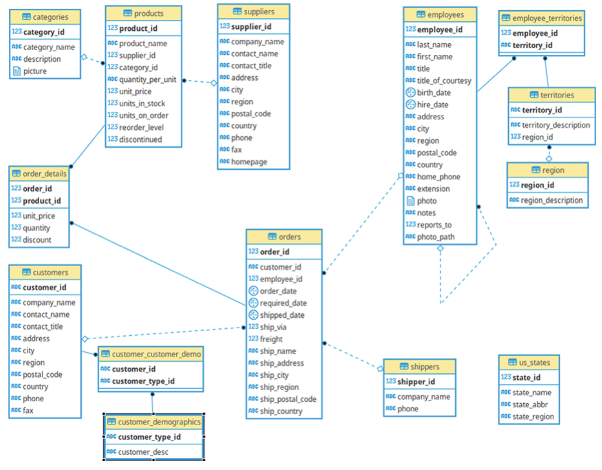

## 📒 Data Dictionary

<details>
<summary>
Categories Table
</summary>

| Primary Key | Foreign Key | Index | Name         | Data type | Length | Nullable | Default | Description                                        |
|-------------|-------------|-------|--------------|-----------|--------|----------|---------|----------------------------------------------------|
| PK          |             | IX    | CategoryID   | int       |        |          |         | Categories of Northwind products.                  |
|             |             | IX    | CategoryName | varchar   | -15    |          |         | Name of food category.                             |
|             |             |       | Description  | text      |        | Yes      |         | Full description of the category. Provide samples. |
|             |             |       | Picture      | image     |        | Yes      |         | A picture representing the food category.          |


</details>


<details>
<summary>
CustomerCustomerDemo Table
</summary>

| Primary Key | Foreign Key | Index | Name           | Data type | Length | Nullable | Default | Description |
|-------------|-------------|-------|----------------|-----------|--------|----------|---------|-------------|
| PK          | FK          | IX    | CustomerID     | varchar   | -5     |          |         |             |
| PK          | FK          | IX    | CustomerTypeID | varchar   | -10    |          |         |             |


</details>

<details>
<summary>
CustomerDemographics Table
</summary>


| Primary Key | Foreign Key | Index | Name           | Data type | Length | Nullable | Default | Description |
|-------------|-------------|-------|----------------|-----------|--------|----------|---------|-------------|
| PK          |             | IX    | CustomerTypeID | varchar   | -10    |          |         |             |
|             |             |       | CustomerDesc   | ntext     |        | Yes      |         |             |

</details>

<details>
<summary>
Customers Table     
</summary>

| Primary Key | Foreign Key | Index | Name         | Data type | Length | Nullable | Default | Description                                        |
|-------------|-------------|-------|--------------|-----------|--------|----------|---------|----------------------------------------------------|
| PK          |             | IX    | CustomerID   | varchar   | -5     |          |         | Unique five-character code based on customer name. |
|             |             | IX    | CompanyName  | varchar   | -40    |          |         |                                                    |
|             |             |       | ContactName  | varchar   | -30    | Yes      |         |                                                    |
|             |             |       | ContactTitle | varchar   | -30    | Yes      |         |                                                    |
|             |             |       | Address      | varchar   | -60    | Yes      |         | Street or post-office box.                         |
|             |             | IX    | City         | varchar   | -15    | Yes      |         |                                                    |
|             |             | IX    | Region       | varchar   | -15    | Yes      |         | State or province.                                 |
|             |             | IX    | PostalCode   | varchar   | -10    | Yes      |         |                                                    |
|             |             |       | Country      | varchar   | -15    | Yes      |         |                                                    |
|             |             |       | Phone        | varchar   | -24    | Yes      |         | Phone number includes country code or area code.   |
|             |             |       | Fax          | varchar   | -24    | Yes      |         | Phone number includes country code or area code.   |

</details>

<details>
<summary>
Employees Table
</summary>

| Primary Key | Foreign Key | Index | Name            | Data type | Length | Nullable | Default | Description                                      |
|-------------|-------------|-------|-----------------|-----------|--------|----------|---------|--------------------------------------------------|
| PK          |             | IX    | EmployeeID      | int       |        |          |         | Number automatically assigned to new employee.   |
|             |             | IX    | LastName        | varchar   | -20    |          |         |                                                  |
|             |             |       | FirstName       | varchar   | -10    |          |         |                                                  |
|             |             |       | Title           | varchar   | -30    | Yes      |         | Employee's title.                                |
|             |             |       | TitleOfCourtesy | varchar   | -25    | Yes      |         |                                                  |
|             |             |       | BirthDate       | datetime  |        | Yes      |         |                                                  |
|             |             |       | HireDate        | datetime  |        | Yes      |         |                                                  |
|             |             |       | Address         | varchar   | -60    | Yes      |         | Street or post-office box.                       |
|             |             |       | City            | varchar   | -15    | Yes      |         |                                                  |
|             |             |       | Region          | varchar   | -15    | Yes      |         | Street or post-office box.                       |
|             |             | IX    | PostalCode      | varchar   | -10    | Yes      |         |                                                  |
|             |             |       | Country         | varchar   | -15    | Yes      |         |                                                  |
|             |             |       | HomePhone       | varchar   | -24    | Yes      |         | Phone number includes country code or area code. |
|             |             |       | Extension       | varchar   | -4     | Yes      |         | Internal telephone extension number.             |
|             |             |       | Photo           | image     |        | Yes      |         | Picture of employee.                             |
|             |             |       | Notes           | text      |        | Yes      |         | General information about employee's background. |
|             | FK          |       | ReportsTo       | int       |        | Yes      |         | Employee's supervisor.                           |
|             |             |       | PhotoPath       | varchar   | -255   | Yes      |         |                                                  |


</details>


<details>
<summary>
EmployeeTerritories Table
</summary>

| Primary Key | Foreign Key | Index | Name        | Data type | Length | Nullable | Default | Description |
|-------------|-------------|-------|-------------|-----------|--------|----------|---------|-------------|
| PK          | FK          | IX    | EmployeeID  | int       |        |          |         |             |
| PK          | FK          | IX    | TerritoryID | varchar   | -20    |          |         |             |


</details>

<details>
<summary>
OrderDetails Table
</summary>

| Primary Key | Foreign Key | Index | Name      | Data type | Length | Nullable | Default | Description                           |
|-------------|-------------|-------|-----------|-----------|--------|----------|---------|---------------------------------------|
| PK          | FK          | IX    | OrderID   | int       |        |          |         | Same as Order ID in Orders table.     |
| PK          | FK          | IX    | ProductID | int       |        |          |         | Same as Product ID in Products table. |
|             |             |       | UnitPrice | decimal   |        |          | 0       |                                       |
|             |             |       | Quantity  | smallint  |        |          | -1      |                                       |
|             |             |       | Discount  | decimal   |        |          | 0       |                                       |


</details>

<details>
<summary>
Orders Table
</summary>

| Primary Key | Foreign Key | Index | Name           | Data type | Length | Nullable | Default | Description                                        |
|-------------|-------------|-------|----------------|-----------|--------|----------|---------|----------------------------------------------------|
| PK          |             | IX    | OrderID        | int       |        |          |         |                                                    |
|             | FK          | IX    | CustomerID     | varchar   | -5     | Yes      |         |                                                    |
|             | FK          | IX    | EmployeeID     | int       |        | Yes      |         | Same entry as in Employees table.                  |
|             |             | IX    | OrderDate      | datetime  |        | Yes      |         |                                                    |
|             |             |       | RequiredDate   | datetime  |        | Yes      |         |                                                    |
|             |             | IX    | ShippedDate    | datetime  |        | Yes      |         |                                                    |
|             | FK          | IX    | ShipVia        | int       |        | Yes      |         | Same as Shipper ID in Shippers table.              |
|             |             |       | Freight        | decimal   |        | Yes      | 0       |                                                    |
|             |             |       | ShipName       | varchar   | -40    | Yes      |         | Name of person or company to receive the shipment. |
|             |             |       | ShipAddress    | varchar   | -60    | Yes      |         | Street address only -- no post-office box allowed. |
|             |             |       | ShipCity       | varchar   | -15    | Yes      |         |                                                    |
|             |             |       | ShipRegion     | varchar   | -15    | Yes      |         | State or province.                                 |
|             |             | IX    | ShipPostalCode | varchar   | -10    | Yes      |         |                                                    |
|             |             |       | ShipCountry    | varchar   | -15    | Yes      |         |                                                    |


</details>

<details>
<summary>
Products Table
</summary>

| Primary Key | Foreign Key | Index | Name            | Data type | Length | Nullable | Default | Description                                   |
|-------------|-------------|-------|-----------------|-----------|--------|----------|---------|-----------------------------------------------|
| PK          |             | IX    | ProductID       | int       |        |          |         | Number automatically assigned to new product. |
|             |             | IX    | ProductName     | nvarchar  | -40    |          |         |                                               |
|             | FK          | IX    | SupplierID      | int       |        | Yes      |         | Same entry as in Suppliers table.             |
|             | FK          | IX    | CategoryID      | int       |        | Yes      |         | Same entry as in Categories table.            |
|             |             |       | QuantityPerUnit | nvarchar  | -20    | Yes      |         | "(e.g., 24-count case, 1-liter bottle)."      |
|             |             |       | UnitPrice       | money     |        | Yes      | 0       |                                               |
|             |             |       | UnitsInStock    | smallint  |        | Yes      | 0       |                                               |
|             |             |       | UnitsOnOrder    | smallint  |        | Yes      | 0       |                                               |
|             |             |       | ReorderLevel    | smallint  |        | Yes      | 0       | Minimum units to maintain in stock.           |
|             |             |       | Discontinued    | bit       |        |          | 0       | Yes means item is no longer available.        |


</details>

<details>
<summary>
Region Table
</summary>

| Primary Key | Foreign Key | Index | Name              | Data type | Length | Nullable | Default | Description |
|-------------|-------------|-------|-------------------|-----------|--------|----------|---------|-------------|
| PK          |             | IX    | RegionID          | int       |        |          |         |             |
|             |             |       | RegionDescription | varchar   | -50    |          |         |             |


</details>

<details>
<summary>
Shippers Table
</summary>

| Primary Key | Foreign Key | Index | Name        | Data type | Length | Nullable | Default | Description                                      |
|-------------|-------------|-------|-------------|-----------|--------|----------|---------|--------------------------------------------------|
| PK          |             | IX    | ShipperID   | int       |        |          |         | Number automatically assigned to new shipper.    |
|             |             |       | CompanyName | varchar   | -40    |          |         | Name of shipping company.                        |
|             |             |       | Phone       | varchar   | -24    | Yes      |         | Phone number includes country code or area code. |


</details>

<details>
<summary>
Suppliers Table
</summary>

| Primary Key | Foreign Key | Index | Name         | Data type | Length | Nullable | Default | Description                                      |
|-------------|-------------|-------|--------------|-----------|--------|----------|---------|--------------------------------------------------|
| PK          |             | IX    | SupplierID   | int       |        |          |         | Number automatically assigned to new supplier.   |
|             |             | IX    | CompanyName  | varchar   | -40    |          |         |                                                  |
|             |             |       | ContactName  | varchar   | -30    | Yes      |         |                                                  |
|             |             |       | ContactTitle | varchar   | -30    | Yes      |         |                                                  |
|             |             |       | Address      | varchar   | -60    | Yes      |         | Street or post-office box.                       |
|             |             |       | City         | varchar   | -15    | Yes      |         |                                                  |
|             |             |       | Region       | varchar   | -15    | Yes      |         | State or province.                               |
|             |             | IX    | PostalCode   | varchar   | -10    | Yes      |         |                                                  |
|             |             |       | Country      | varchar   | -15    | Yes      |         |                                                  |
|             |             |       | Phone        | varchar   | -24    | Yes      |         | Phone number includes country code or area code. |
|             |             |       | Fax          | varchar   | -24    | Yes      |         | Phone number includes country code or area code. |
|             |             |       | HomePage     | ntext     |        | Yes      |         | Supplier's home page on World Wide Web.          |


</details>

<details>
<summary>
Territories Table
</summary>

| Primary Key | Foreign Key | Index | Name                 | Data type | Length | Nullable | Default | Description |
|-------------|-------------|-------|----------------------|-----------|--------|----------|---------|-------------|
| PK          |             | IX    | TerritoryID          | varchar   | -20    |          |         |             |
|             |             |       | TerritoryDescription | varchar   | -50    |          |         |             |
|             | FK          |       | RegionID             | int       |        |          |         |             |


</details>

## 📊 Business Question
### **Question 1**❓

For their annual review of the company pricing strategy, the Product Team wants to look at the products that are currently being offered for a specific price range ($20 to $50). In order to help them they asked you to provide them with a list of products with the following information:

1. their name
2. their unit price

Filtered on the following conditions:

1. their unit price is between 20 and 50
2. they are not discontinued

Finally order the results by unit price in a descending order (highest first).

<details>
<summary>
Output example
</summary>

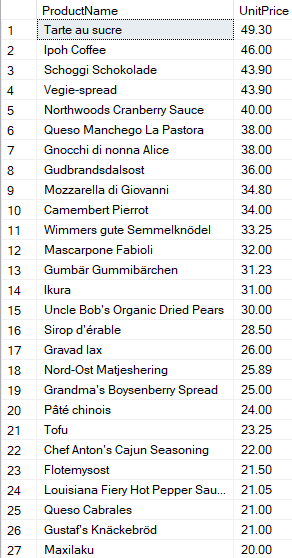

</details>

<details>
<summary>
💡 Solution
</summary>

```sql
--Solution Query
select 
	ProductName, 
	UnitPrice 
from Products
where UnitPrice between 20 and 50
and discontinued=0
order by UnitPrice desc;

```
</details>

### **Question 2**❓

The Logistics Team wants to do a retrospection of their performances for the year 1998, in order to identify for which countries they didn’t perform well. They asked you to provide them a list of countries with the following information:

1. their average days between the order date and the shipping date (formatted to have only 2 decimals)
2. their total number of orders (based on the order date) 
Filtered on the following conditions:

1. the year of order date is 1998
2. their average days between the order date and the shipping date is greater or equal 5 days
3. their total number of orders is greater than 10 orders

Finally order the results by country name in an ascending order (lowest first).

<details>
<summary>
Output example
</summary>

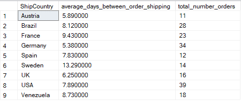

</details>

<details>
<summary>
💡 Solution
</summary>

```sql
-- Solution Query
WITH cte_avg_days AS (
	SELECT
		ShipCountry,
		ROUND(AVG(datediff(DAY, OrderDate, ShippedDate ) * 1.0), 2) AS average_days_between_order_shipping,
		COUNT(*) AS total_number_orders
	FROM Orders
	WHERE YEAR(OrderDate) = 1998
	GROUP BY ShipCountry
)
SELECT * FROM cte_avg_days
WHERE average_days_between_order_shipping >= 5
AND total_number_orders > 10
	ORDER BY ShipCountry;
```

</details>

### **Question 3**❓
The HR Team wants to know for each employee what was their age on the date they joined the company and who they currently report to. Provide them with a list of every employees with the following information:

1. their full name (first name and last name combined in a single field)
2. their job title
3. their age at the time they were hired
4. their manager full name (first name and last name combined in a single field)
5. their manager job title

Finally order the results by employee age and employee full name in an ascending order (lowest first).

<details>
<summary>
Output example
</summary>

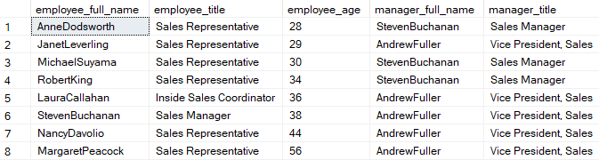

</details>

<details>
<summary>
💡 Solution
</summary>

```sql
--Solution Query
select 
	e.FirstName+''+e.LastName as employee_full_name,
	e.Title as employee_title,
	DATEDIFF(year, e.BirthDate, e.HireDate) as employee_age,
	m.FirstName+''+m.LastName as manager_full_name,
	m.Title as manager_title
from Employees as e
inner join Employees as m 
on m.EmployeeID = e.ReportsTo
order by employee_age, employee_full_name;
```

</details>

### **Question 4**❓
The Logistics Team wants to do a retrospection of their global performances over 1997-1998, in order to identify for which month they perform well. They asked you to provide them a list with:

1. their year/month as single field in a date format (e.g. “1996-01-01” January 1996)
2. their total number of orders
3. their total freight (formatted to have no decimals)

Filtered on the following conditions:

1. the order date is between 1997 and 1998
2. their total number of orders is greater than 35 orders

Finally order the results by total freight (descending order).

<details>
<summary>
Output example
</summary>

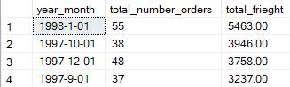
</details>

<details>
<summary>
💡 Solution
</summary>

```sql
--Solution Query

with cte_freight as (
	select
		CAST(year(OrderDate) as varchar) + '-' +
		CAST(month(OrderDate) as varchar) + '-01' as year_month,
		COUNT(*) as total_number_orders,
		ROUND(sum(Freight),0) as total_frieght
	from Orders
	where OrderDate >= '1997-01-01' and OrderDate < '1998-01-31'
	group by
		CAST(year(OrderDate) as varchar) + '-' +
		CAST(month(OrderDate) as varchar) + '-01'
)
select *
from cte_freight
where total_number_orders>35
order by total_frieght desc;
```

</details>

### **Question 5**❓
The Pricing Team wants to know which products had an unit price increase and the percentage increase was not between 20% and 30%. In order to help them they asked you to provide them a list of products with:

1. their product name
2. their current unit price (formatted to have only 2 decimals)
3. their previous unit price (formatted to have only 2 decimals)
4. their percentage increase as: 

*(New Number -  Original Number) ÷ Original Number × 100* (with the result formatted to an integer, e.g 50 for 50%)

Filtered on the following conditions:

1. their percentage increase is not between 20% and 30%
2. their total number of orders is greater than 10 orders

Finally order the results by percentage increase (ascending order).

<details>
<summary>
Output example
</summary>

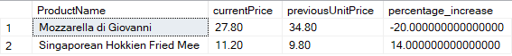

</details>

<details>
<summary>
💡 Solution
</summary>

```sql
--Solution Query
with cte_price as (
    select
        d.ProductID,
        p.ProductName,
        round(lead(d.UnitPrice) over (partition by p.productName order by o.orderDate), 2) as currentPrice,
        round(lag(d.UnitPrice) over (partition by p.productName order by o.orderDate), 2) as previousUnitPrice
    from
        Products as p
    inner join
        [Order Details] as d on p.ProductID = d.ProductID
    inner join
        Orders as o on d.OrderID = o.OrderID
)
select
    c.ProductName,
    c.currentPrice,
    c.previousUnitPrice,
    round(100.0 * (c.currentPrice - c.previousUnitPrice) / c.previousUnitPrice, 0) as percentage_increase
from
    cte_price as c
inner join
    [Order Details] as d on c.productID = d.ProductID
where
    c.currentPrice <> c.previousUnitPrice
group by
    c.ProductName,
    c.currentPrice,
    c.previousUnitPrice
having
    count(distinct d.OrderID) > 10
    and round(100.0 * (c.currentPrice - c.previousUnitPrice) / c.previousUnitPrice, 0) not between 20 and 30;
```

</details>

### **Question 6**❓
The Pricing Team wants to know how each category performs according to their price range. In order to help them they asked you to provide them a list of categories with:

1. their category name
2. their price range as: 

    * “1.Below $20”

    *  “2. $20 - $50”

    * “3. Over $50”

3. their total amount (formatted to be integer)
4. their number of orders

Finally order the results by category name then price range (both ascending order).

<details>
<summary>
Output example
</summary>

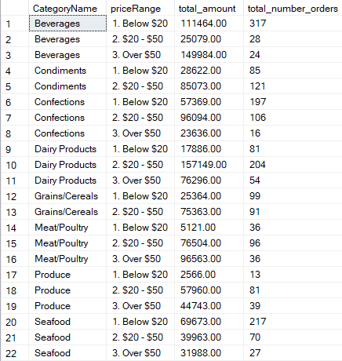

</details>

<details>
<summary>
💡 Solution
</summary>

```sql
--Solution Query
select
    c.CategoryName,
    case
        when p.UnitPrice < 20 then '1. Below $20'
        when p.UnitPrice >= 20 and p.UnitPrice <= 50 then '2. $20 - $50'
        when p.UnitPrice > 50 then '3. Over $50'
    end as priceRange,
    round(sum(d.UnitPrice * d.Quantity),0) as total_amount,
    count(distinct d.OrderID) as total_number_orders
from
    Categories as c
inner join
    Products as p on c.CategoryID = p.CategoryID
inner join
    [Order Details] as d on d.ProductID = p.ProductID
group by
    c.CategoryName,
    case
        when p.UnitPrice < 20 then '1. Below $20'
        when p.UnitPrice >= 20 and p.UnitPrice <= 50 then '2. $20 - $50'
        when p.UnitPrice > 50 then '3. Over $50'
    end
order by
    c.CategoryName,
    priceRange;
```
</details>

### **Question 7**❓
The Logistics Team wants to know what is the current state of our regional suppliers' stocks for each category of product. In order to help them they asked you to provide them a list of categories with:

1. their supplier region” as: 
   * “America”
   * “Europe”
   * “Asia-Pacific”
2. their category name
3. their total units in stock
4. their total units on order
5. heir total reorder level

Finally order the results by supplier region then category name then price range (each in ascending order).

<details>
<summary>
Output example
</summary>

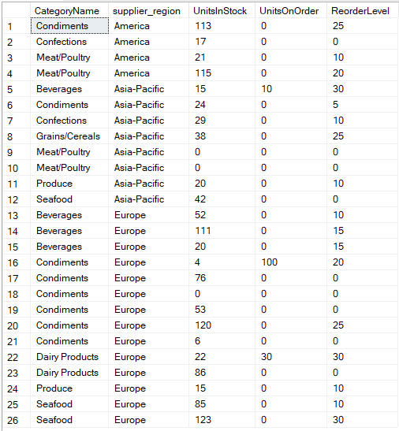

</details>

<details>
<summary>
💡 Solution
</summary>

```sql
--Solution Query
select
    c.CategoryName,
    case
        when s.country IN ('Australia', 'Singapore', 'Japan') then 'Asia-Pacific'
        when s.country IN ('US', 'Brazil', 'Canada') then 'America'
        else 'Europe'
    end as supplier_region,
    p.UnitsInStock,
    p.UnitsOnOrder,
    p.ReorderLevel
from
    Suppliers as s
inner join
    Products as p on s.SupplierID = p.SupplierID
inner join
    Categories as c on p.CategoryID = c.CategoryID
where
    s.region is not null
order by
    supplier_region,
    c.CategoryName,
    p.UnitPrice;
```
</details>


### **Question 8**❓
The Pricing Team wants to know for each currently offered product how their unit price compares against their categories average and median unit price. In order to help them they asked you to provide them a list of products with:

1. their category name
2. their product name
3. their unit price
4. their category average unit price (formatted to have only 2 decimals)
5. their category median unit price (formatted to have only 2 decimals)
6. their position against the category average unit price as:
   * “Below Average”
   * “Equal Average”
   * “Over Average”
7. their position against the category median unit price as:
   * “Below Median”
   * “Equal Median”
   * “Over Median”

Filtered on the following conditions:
   * They are not discontinued 

Finally order the results by category name then product name (both ascending).

<details>
<summary>
Output example
</summary>

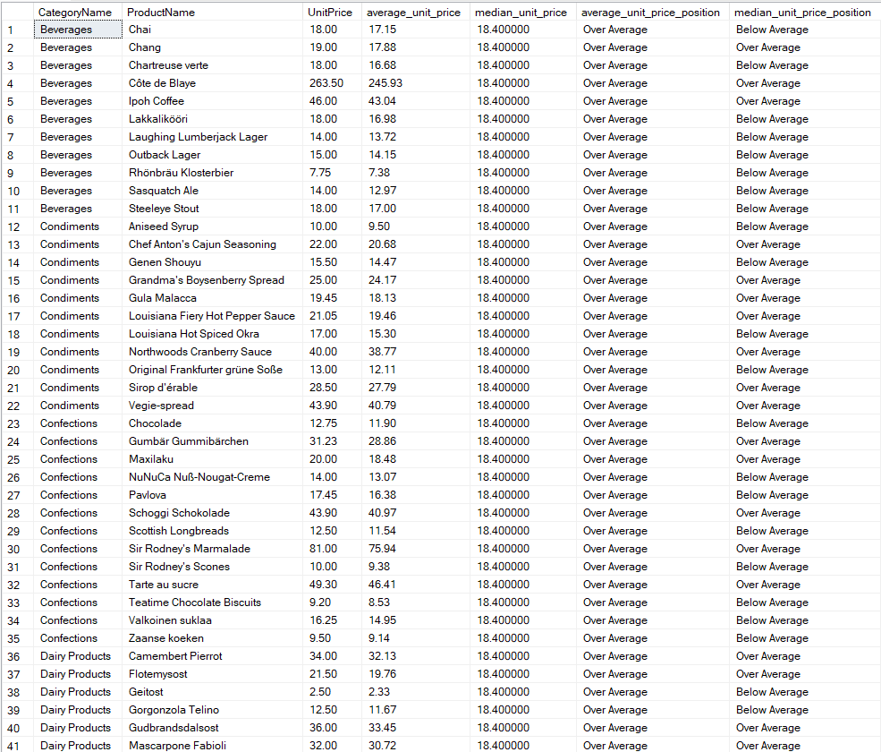

</details>

<details>
<summary>
💡 Solution
</summary>

```sql
--Solution Query
with cte_price as (
    select
        c.CategoryName,
        p.ProductName,
        p.UnitPrice,
        round(avg(d.UnitPrice), 2) as average_unit_price,
		(
			select
                round(avg(1.0 * UnitPrice), 2)
            from( select UnitPrice, row_number() over (order by UnitPrice) as row_num, count(*) over () as total_rows
				from [Order Details] where ProductID = ProductID ) as subquery
            where
                row_num in (floor((total_rows + 1) / 2.0), floor((total_rows + 2) / 2.0))
        ) as median_unit_price from Categories as c
    inner join
        Products as p on c.CategoryID = p.CategoryID
    inner join
        [Order Details] as d on p.ProductID = d.ProductID
    where
        p.discontinued = 0
    group by
        c.CategoryName,
        p.ProductName,
        p.UnitPrice
)
select
    CategoryName,
    ProductName,
    UnitPrice,
    average_unit_price,
    median_unit_price,
    case
        when UnitPrice > average_unit_price then 'Over Average'
        when UnitPrice = average_unit_price then 'Equal Average'
        when UnitPrice < average_unit_price then 'Below Average'
    end AS average_unit_price_position,
    case
        when UnitPrice > median_unit_price then 'Over Average'
        when UnitPrice = median_unit_price then 'Equal Average'
        when UnitPrice < median_unit_price then 'Below Average'
    end as median_unit_price_position
from
    cte_price
order by
    CategoryName,
    ProductName;
```
</details>


### **Question 9**❓

The Sales Team wants to build a list of KPIs to measure employees' performances. In order to help them they asked you to provide them a list of employees with:

1. their full name (first name and last name combined in a single field)
2. their job title
3. their total sales amount excluding discount (formatted to have only 2 decimals)
4. their total number of orders
5. their total number of entries (each row of an order)
6. their average amount per entry (formatted to have only 2 decimals)
7. their average amount per order (formatted to have only 2 decimals)
8. their total discount amount (formatted to have only 2 decimals)
9. their total sales amount including discount (formatted to have only 2 decimals)
10. Their total discount percentage (formatted to have only 2 decimals)

Finally order the results by total sales amount including discount (descending).

<details>
<summary>
Output example
</summary>

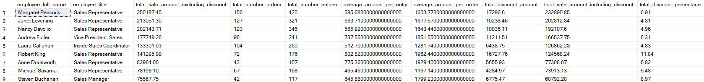

</details>

<details>
<summary>
💡 Solution
</summary>

```sql
--Solution Query
with cte_kpi as (
    select
        e.FirstName + ' ' + e.LastName as employee_full_name,
        e.Title as employee_title,
        round(sum(d.Quantity * d.UnitPrice), 2) as total_sale_amount_excluding_discount,
        count(distinct d.OrderID) as total_number_orders,
        count(d.OrderID) as total_number_entries,
        round(sum(d.Discount * (d.Quantity * d.UnitPrice)), 2) as total_discount_amount,
        round(sum((1 - d.Discount) * (d.Quantity * d.UnitPrice)), 2) as total_sale_amount_including_discount
    from
        Orders as o
    inner join
        Employees as e on o.EmployeeID = e.EmployeeID
    inner join
        [Order Details] as d on d.OrderID = o.OrderID
    inner join
        Products as p on d.ProductID = p.ProductID
    group by
        e.FirstName + ' ' + e.LastName,
        e.Title
)
select
    employee_full_name,
    employee_title,
    total_sale_amount_excluding_discount,
    total_number_orders,
    total_number_entries,
    round(total_sale_amount_excluding_discount * 1.0 / total_number_entries, 2) as average_amount_per_entry,
    round(total_sale_amount_excluding_discount * 1.0 / total_number_orders, 2) as average_amount_per_order,
    total_discount_amount,
    total_sale_amount_including_discount,
    round((total_sale_amount_excluding_discount - total_sale_amount_including_discount) / total_sale_amount_excluding_discount * 100, 2) as total_discount_percentage
from
    cte_kpi
order by
    total_sale_amount_including_discount desc;
```
</details>


### **Question 10** ❓
The Sales Team wants to build another list of KPIs to measure employees' performances across each category. In order to help them they asked you to provide them a list of categories and employees with:

1. their categories name
2. their full name (first name and last name combined in a 3. single field)
3. their total sales amount including discount (formatted to have only 2 decimals)
4. their percentage of total sales amount against the total sales amount across all employees (formatted to have only 2 decimals)
5. their percentage of total sales amount against the total sales amount for each employees (formatted to have only 2 decimals)

Finally order the results by category name (ascending) then total sales amount (descending).

<details>
<summary>
Output example
</summary>

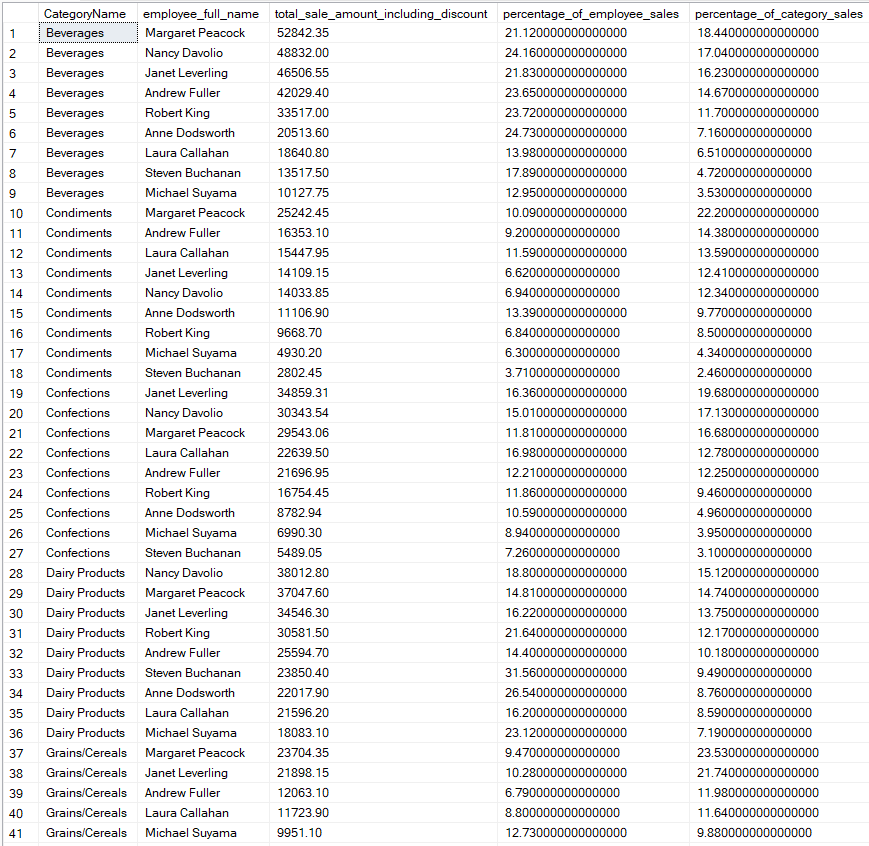

</details>

<details>
<summary>
💡 Solution
</summary>
	
```sql
--Solution Query
with cte_kpi as (
    select
        c.CategoryName,
        e.FirstName + ' ' + e.LastName as employee_full_name,
        round(sum(d.Quantity * d.UnitPrice), 2) as total_sale_amount_including_discount
    from
        Employees as e
    inner join
        Orders as o on e.EmployeeID = o.EmployeeID
    inner join
        [Order Details] as d on o.OrderID = d.OrderID
    inner join
        Products as p on d.ProductID = p.ProductID
    inner join
        Categories as c on c.CategoryID = p.CategoryID
	group by
        c.CategoryName,
        e.FirstName + ' ' + e.LastName
)
select
    CategoryName,
    employee_full_name,
    total_sale_amount_including_discount,
    round(
        sum(total_sale_amount_including_discount) * 100.0 /
        sum(sum(total_sale_amount_including_discount)) over (partition by employee_full_name),
        2
    ) AS percentage_of_employee_sales,
    round(
        sum(total_sale_amount_including_discount) * 100.0 /
        sum(sum(total_sale_amount_including_discount)) over (partition by CategoryName),
        2
    ) as percentage_of_category_sales
from
    cte_kpi
group by
    CategoryName,
    employee_full_name,
    total_sale_amount_including_discount
order by
    CategoryName,
    total_sale_amount_including_discount desc;
```
</details>

<p>Thank you ✨</p>
